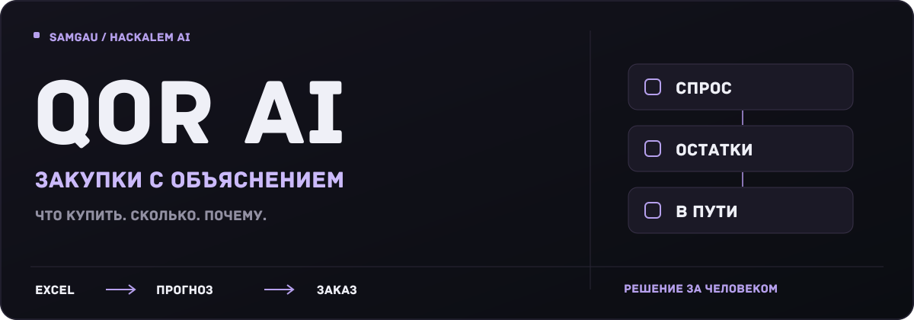
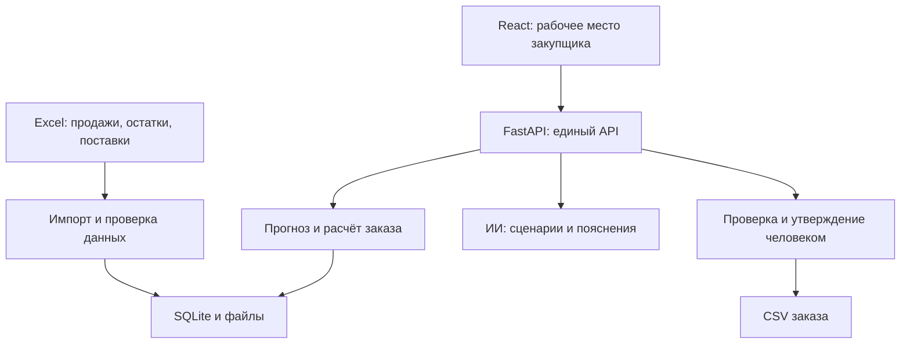

<p align="center">
  <strong><a href="https://qor.152.70.57.1.sslip.io">Открыть QOR AI — рабочее демо</a></strong><br />
  Публичный сайт с HTTPS · серверный расчёт на синтетических данных
</p>

<p align="center">
  
</p>

<p align="center">
  
</p>

<p align="center">
  <strong>Объяснимый помощник закупщика</strong><br />
  От истории продаж и остатков - к обоснованному заказу поставщику.
</p>

<p align="center">
  <a href="#idea">Идея</a> ·
  <a href="#features">Возможности</a> ·
  <a href="#ai">Искусственный интеллект</a> ·
  <a href="#start">Запуск</a> ·
  <a href="#architecture">Технологии</a> ·
  <a href="#team">Документация</a>
</p>

<p align="center"><code>React + TypeScript</code> &nbsp; <code>FastAPI + Python</code> &nbsp; <code>SQLite</code> &nbsp; <code>OpenAI / NVIDIA</code></p>

> **Статус: MVP.** React подключён к FastAPI через Bearer-сессию. Реализованы расчёт, интерактивный 3D-склад, импорт исходных XLSX и выгрузка утверждённого CSV. Общий Docker Compose собирает React + FastAPI + Caddy. Публичный HTTPS и загрузка серверного расчёта в браузере проверены 23.09.2026. OpenAI настроен на сервере; настоящий вызов при развёртывании не проверялся. Совместимость CSV с обработкой конкретной базы 1С требует отдельной проверки. [Файловый обмен и запуск →](docs/ONE_C_EXCHANGE.md) · [План и критерии интеграции →](docs/CAPTAIN_UI_INTEGRATION.md)

<a id="idea"></a>
## 

**QOR ai помогает закупщикам и специалистам по управлению запасами понять, какие товары пора заказать, в каком количестве и на основании каких данных.** Проект команды **Samgau** создан для кейса ТОО **«Электрокомплект»** на HackAlem AI.

Когда расчёты собирают вручную из нескольких Excel, склад легко оказывается между двумя проблемами: нужный товар закончился, а лишний занимает место и замораживает деньги. Разовая крупная покупка искажает средние продажи. Отсутствие товара скрывает спрос: продали ноль, хотя купить хотели.

| Ситуация закупщика | Как помогает QOR ai |
|---|---|
| Один клиент купил необычно много | Отделяет разовую часть покупки от регулярной потребности; клиентский анализ возможен при наличии обезличенного ID |
| Товар отсутствовал, поэтому продажи упали | Оценивает упущенный спрос при известных интервалах отсутствия |
| Часть товара уже заказана | Учитывает количество в пути и даты поступления |
| Спрос меняется по сезонам или растёт | Применяет сезонность и поправку на изменение спроса |
| Нужно объяснить закупку руководителю | Показывает формулу, факторы, источники и предупреждения по позиции |

Для логиста, отвечающего за пополнение склада, это способ заранее увидеть риск дефицита и обсудить ускорение поставки. Для закупщика — основа для проверки и утверждения заказа. **Ожидаемая польза:** меньше ручной сверки, меньше повторных закупок уже заказанного товара и более понятные решения. Проценты экономии пока не измерены.

<a id="features"></a>
## 

<table>
  <tr>
    <td width="50%" valign="top"><strong>Обзор склада</strong><br />Показатели, интерактивный 3D-склад, графики продаж и прогноз запаса помогают выбрать позиции для проверки.</td>
    <td width="50%" valign="top"><strong>План закупок</strong><br />Рекомендации по товарам и поставщикам, поиск, фильтры риска и качества данных.</td>
  </tr>
  <tr>
    <td valign="top"><strong>Паспорт решения</strong><br />Формула заказа, история, факторы и ограничения — рядом с рассчитанным количеством.</td>
    <td valign="top"><strong>«Что, если…»</strong><br />Проверка задержки поставки или изменения спроса с новым расчётом и сравнением.</td>
  </tr>
  <tr>
    <td valign="top"><strong>Проверка данных</strong><br />Пропуски и неопределённость показываются явно: неизвестный остаток не превращается в ноль.</td>
    <td valign="top"><strong>Проверка и выгрузка заказа</strong><br />Менеджер корректирует количество с причиной, утверждает черновик и выгружает CSV.</td>
  </tr>
</table>

Экраны работают с API: отдельный расчёт для каждого поставщика, реальные партии для сценария, проверка предупреждений и утверждённый CSV. Раздел **«Обмен с 1С»** принимает шесть XLSX одного поставщика и необязательный `inventory.csv`. Формат, ограничения данных и проверка совместимости описаны в [документации обмена](docs/ONE_C_EXCHANGE.md).

**Пользовательский путь:**

1. Выбрать серверный синтетический набор или загрузить данные компании в разделе «Обмен с 1С».
2. Выбрать поставщика и дату расчёта.
3. Открыть рекомендации и проверить проблемные позиции.
4. Посмотреть «Почему так?» — какие данные повлияли на количество.
5. При необходимости проверить сценарий задержки или роста спроса.
6. Проверить заказ, обосновать ручные изменения, утвердить и скачать CSV.

**Заказ поставщику автоматически не отправляется.** Финальное решение принимает ответственный сотрудник.

<details>
<summary><strong>Как рассчитывается количество</strong></summary>

Предварительная потребность:

```text
Прогноз на горизонт + страховой запас
− свободный остаток − своевременные поставки в пути
```

Отрицательная потребность становится нулём. Положительная переводится в единицу заказа и округляется с учётом минимальной партии и кратности. Поздняя поставка не отменяет дефицит, который возникнет раньше её прибытия.

Например: **210 + 70 − 80 − 50 = 150**. При кратности 12 рекомендуемый заказ — **156 штук**. Если партия 50 штук приедет за пределами горизонта, результат после округления — **204 штуки**. Это контрольный пример, а не измеренный результат экономии компании.

Текущий алгоритм очистки использует медиану и медианное абсолютное отклонение (MAD), с проверками достаточности истории и повторяемости крупных покупок. Компенсация отсутствия товара и сезонные поправки выполняются в Python. Подробности: [движок расчёта](backend/app/engine/README.md).

</details>

<a id="ai"></a>
## 

**ИИ помогает работать с результатом на обычном языке.** В проекте подготовлены три функции:

| Функция | Пример запроса | Польза клиенту |
|---|---|---|
| Разбор сценария | «Задержи выбранную поставку на неделю, спрос вырастет на 20%» | Превращает фразу в параметры для проверки и подтверждения |
| Объяснение рекомендации | «Почему предложено столько заказать?» | Выделяет подтверждённые факторы уже выполненного расчёта |
| Помощник по интерфейсу | «Где выгрузить заказ?» | Подсказывает следующий шаг и помогает ориентироваться в текущем экране |

Количество рассчитывает статистический модуль. Модель не назначает объём закупки самостоятельно. Сервер проверяет распознанные параметры и коды факторов; применение сценария и утверждение заказа остаются отдельными действиями пользователя.

**Подключение:** OpenAI либо NVIDIA через серверный адаптер.Конкретная модель задаётся настройками команды. При недоступности провайдера показывается явно обозначенная справка или расчётное объяснение — такой ответ не выдаётся за результат ИИ.

<details>
<summary><strong>Настройка настоящего ИИ</strong></summary>

В корневом `.env`:

```dotenv
AI_PROVIDER=openai
OPENAI_API_KEY=ваш_ключ
OPENAI_MODEL=идентификатор_доступной_модели
AI_RESPONSE_FORMAT=json_schema
ALLOW_REAL_AI=false
```

Для NVIDIA используются `NVIDIA_API_KEY`, `NVIDIA_MODEL`, `NVIDIA_BASE_URL` и `AI_PROVIDER=nvidia`. Общие `AI_API_KEY`, `AI_MODEL`, `AI_BASE_URL`, если заполнены, имеют приоритет. Формат ответа должен поддерживаться выбранной моделью.

Перезапустите backend и выполните `scripts/ai_smoke.py` при работающем сервере. Также проверьте чат через интерфейс. Успешная конфигурация не заменяет успешный сетевой вызов.

Ключи хранятся только на сервере, не попадают в Git и переменные `VITE_*`. Передача реальных коммерческих данных внешнему ИИ по умолчанию отключена; разрешение определяет владелец данных. [Документация помощника →](docs/ASSISTANT.md)

</details>

<a id="start"></a>
## 

Нужны **Python 3.12**, **Node.js 22** и Git. Для Docker-сценария — Docker Engine/поддерживаемый Docker Desktop и Compose v2. Ключ ИИ для синтетического демо не нужен.

```bash
git clone https://github.com/BAITC-Hacks/hack-7ccada8c-samgau.git
cd hack-7ccada8c-samgau
```

### Посмотреть интерфейс

```bash
cd frontend
npm ci
npm run dev
```

Откройте **http://localhost:5173** и выберите режим **API** для работы с сервером. В Vite можно явно задать `VITE_DATA_MODE=api` в `frontend/.env.local`. Для просмотра без backend выберите локальное демо: **12 синтетических товаров, два поставщика**; демо-черновики живут в памяти вкладки.

### Запустить серверный расчёт

В другом терминале, из корня репозитория:

**Linux / macOS**

```bash
python3.12 -m venv .venv
.venv/bin/python -m pip install -r backend/requirements-dev.lock -r backend/requirements-engine.txt
cp .env.example .env
.venv/bin/python run.py
```

**Windows, PowerShell или cmd**

```powershell
py -3.12 -m venv .venv
.venv\Scripts\python.exe -m pip install -r backend/requirements-dev.lock -r backend/requirements-engine.txt
copy .env.example .env
.venv\Scripts\python.exe run.py
```

Откройте **http://127.0.0.1:8000/api/docs**. Серверный набор `demo-engine-v1` содержит **8 синтетических товаров** и использует движок `qor-mvp-1.0`. Это отдельный набор от локального UI-демо.

> **UI и API используют общую Bearer-сессию.** При локальной разработке Vite перенаправляет `/api` в backend. Серверные наборы и расчёты отличаются от локального демо. Неизвестный остаток и блокировки качества нельзя превращать в утверждённый заказ.

### Проверить решение

При работающем backend, из корня:

```bash
.venv/bin/python scripts/smoke.py
.venv/bin/python -m pytest
```

На Windows используйте `.venv\Scripts\python.exe`. Дополнительная проверка ИИ после настройки ключа:

```bash
.venv/bin/python scripts/ai_smoke.py --url http://127.0.0.1:8000
```

Проверки frontend, из `frontend/`:

```bash
npm test
npm run build
```

**Сценарий для жюри:** открыть режим API и `demo-engine-v1` → выбрать `00001` (156) → задержать выбранную поставку на 30 дней (204) → вернуть исходный расчёт → изменить заказ на 168 с причиной → явно подтвердить предупреждения → утвердить и скачать CSV с количеством 168. Для `00007` проверить 2 бухты по 305 м, для `00008` — блокировку заказа. Серверный путь проверяется через `scripts/smoke.py` и Swagger.

<details>
<summary><strong>Docker и публикация</strong></summary>

Из корня репозитория:

```bash
cp .env.example .env
docker compose up --build -d
```

На Windows: `copy .env.example .env`. Корневой Compose собирает **React + FastAPI + Caddy** на **http://localhost:8080**. Caddy обслуживает React и проксирует `/api`; база и загрузки сохраняются в томе `qor_data`. Для импорта задайте `ADMIN_TOKEN` в корневом `.env`.

Отдельный UI-контейнер:

```bash
docker compose -f frontend/compose.yaml up --build -d
```

Он также использует порт 8080. Не запускайте оба web-контейнера одновременно на одном порту. Остановка соответствующего Compose: `docker compose down` с тем же `-f`, если он использовался. Флаг `-v` удаляет тома — для обычного перезапуска он не нужен.

Для публичного HTTPS задайте домен в `SITE_ADDRESS`, `HTTP_PORT=80`, `HTTPS_PORT=443`, направьте DNS на сервер и откройте эти порты. Подтверждённая публичная ссылка в текущем README не указана. [Обмен, запуск и публикация →](docs/ONE_C_EXCHANGE.md)

</details>

<a id="architecture"></a>
## 

| Часть проекта | Технологии | Назначение |
|---|---|---|
| Интерфейс | React 19, TypeScript, Vite 6, Recharts, Lucide | Рабочее место закупщика, графики и карточки |
| API | Python 3.12, FastAPI, Pydantic | Проверка запросов, сессии, расчёты и заказы |
| Расчёт и импорт | Python, openpyxl | Чтение выгрузок и объяснимый статистический расчёт |
| Хранение | SQLite и файлы импорта | Наборы, расчёты, версии черновиков |
| ИИ | HTTP-адаптер OpenAI / NVIDIA | Сценарии, объяснение, помощник |
| Развёртывание | Docker Compose, Caddy; отдельный UI-образ с Nginx | Упаковка приложения и обслуживание web |
| Проверки | pytest, Vitest, smoke-скрипты | Контракты, алгоритм и воспроизводимые сценарии |

**Архитектура приложения:**



**Источники:** предоставленные наборы IEK и Systeme Electric — динамика продаж, месячные продажи и остатки, товары в пути, сезонность, MOQ/кратность. Импортеры и синтетические примеры находятся в `backend/app/importers/`. Демо не содержит сведения о реальных клиентах.

**Границы текущей версии:**

- В предоставленной детализации нет ID клиента: клиентский анализ проверяется на синтетических данных.
- Месячные снимки остатков не определяют точные интервалы отсутствия товара. Необходимые предположения должны быть обозначены.
- Для IEK нужен актуальный остаток; неизвестные исходные данные могут блокировать утверждение позиции.
- Excel-выгрузки — снимки на дату, а не непрерывная синхронизация с учётной системой.
- CSV не означает готовую интеграцию с конкретной 1С. Прямое подключение к 1С и автоматическая отправка поставщику не реализованы.
- Нет заявленного расчёта маршрутов транспорта, доказанного процента экономии или автоматического исполнения решений ИИ.

<a id="team"></a>
## 

**Samgau · HackAlem AI · кейс «Электрокомплект»**

| Роль | Ответственность |
|---|---|
| Капитан | API, ИИ, сессии, заказы, интеграция и развёртывание |
| Данные и алгоритм | Импорт, прогноз, аномалии, stockout, сезонность и правила заказа |
| Интерфейс | Экраны, графики, работа пользователя и демонстрация |

| Документ | Что внутри |
|---|---|
| [Спецификация MVP](MVP_SPEC_QOR_AI.md) | Идея, требования и границы решения |
| [Интеграция сайта](docs/CAPTAIN_UI_INTEGRATION.md) | Задачи объединения frontend, backend, ИИ и Docker |
| [Frontend](frontend/README.md) | Запуск интерфейса и деморежима |
| [Backend](docs/CAPTAIN_BACKEND.md) | Запуск API и проверка серверной части |
| [API](docs/API.md) · [OpenAPI](docs/openapi.json) | Контракты и форматы |
| [Движок](backend/app/engine/README.md) · [Импорт](backend/app/importers/README.md) | Данные, формулы и алгоритмы |
| [ИИ-помощник](docs/ASSISTANT.md) | Сценарии, ограничения и конфигурация |
| [Файловый обмен с 1С](docs/ONE_C_EXCHANGE.md) | Профили XLSX, актуальные остатки, CSV и ограничения |

При разработке и подготовке документации использовался **Codex**. Наличие AI-инструмента разработки не заменяет проверку ИИ-функций внутри приложения.

<p align="center"><strong>QOR ai — каждый заказ можно объяснить.</strong></p>

<sub>Оформление: логотип команды; графические заголовки — Archive Ukr, Slava Kirilenko. Буквы сохранены как SVG-контуры, поэтому внешний шрифт для их отображения не требуется. Основной текст использует стандартное оформление GitHub.</sub>
